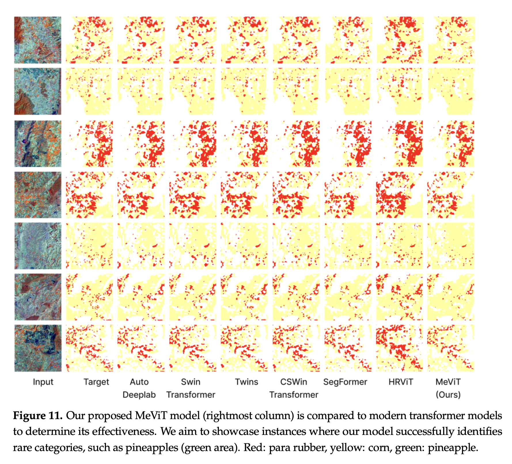

# MeViT: A Medium-Resolution Vision Transformer for Semantic Segmentation on Landsat Satellite Imagery in Thailand

[](LICENSE)

**Author**: Teerapong Panboonyuen (also known as Kao Panboonyuen)  
**Project**: [MeViT: A Medium-Resolution Vision Transformer](https://github.com/kaopanboonyuen/MeViT)  
**Publication**: [MeViT: A Medium-Resolution Vision Transformer for Semantic Segmentation on Landsat Satellite Imagery for Agriculture in Thailand](https://kaopanboonyuen.github.io/MeViT)

## Abstract

Semantic segmentation is a crucial task in remote sensing, focused on classifying every pixel within an image for various land use and land cover (LULC) applications. This project introduces **MeViT** (Medium-Resolution Vision Transformer), a novel approach tailored for Landsat satellite imagery of key economic crops in Thailand, including para rubber, corn, and pineapple. Our method enhances Vision Transformers (ViTs) by integrating medium-resolution, multi-branch architectures, optimized for semantic segmentation. The revised **MixCFN** (Mixed-Scale Convolutional Feedforward Networks) block within MeViT incorporates multiple depth-wise convolution paths, effectively balancing performance and efficiency. 

Through extensive experimentation on Thailand's satellite scenes, **MeViT** has demonstrated superior performance over state-of-the-art deep learning methods, achieving a precision of 92.22%, recall of 94.69%, F1 score of 93.44%, and mean IoU of 83.63%.

## Key Features

- **Medium-Resolution Vision Transformer**: Enhances standard ViTs by introducing a multi-branch architecture optimized for medium-resolution data.
- **Revised MixCFN Block**: Integrates multiple depth-wise convolution paths to efficiently capture multi-scale local information.
- **State-of-the-Art Performance**: Achieves top metrics in semantic segmentation tasks on Landsat imagery, outperforming existing models.


## Installation

Clone the repository and install the required dependencies:

```bash
git clone https://github.com/kaopanboonyuen/MeViT.git
cd MeViT
pip install -r requirements.txt
```

## Usage

1. **Configure Settings**: Adjust the `config.yaml` file with your specific dataset paths and parameters.
2. **Training**: Train the model using the following command:
    ```bash
    python train.py
    ```
3. **Evaluation**: Assess the model’s performance:
    ```bash
    python evaluate.py
    ```
4. **Inference**: Generate segmentation maps using:
    ```bash
    python inference.py
    ```

## Data

- **Landsat Satellite Imagery**: The data used in this project is not included in the repository. Please refer to the project's documentation for details on acquiring and preparing the necessary datasets.


## Project Website

For more details, visit the [project website](https://kaopanboonyuen.github.io/MeViT).

## Citation

If you use this project in your research, please cite our work:

```bibtex
@article{panboonyuen2023mevit,
  title={MeViT: A Medium-Resolution Vision Transformer for Semantic Segmentation on Landsat Satellite Imagery for Agriculture in Thailand},
  author={Panboonyuen, Teerapong and Charoenphon, Chaiyut and Satirapod, Chalermchon},
  journal={Remote Sensing},
  volume={15},
  number={21},
  pages={5124},
  year={2023},
  publisher={MDPI}
}
```

## License

This project is licensed under the MIT License. See the [LICENSE](LICENSE) file for details.

## Acknowledgments

This work is based on research presented at a conference. Special thanks to our collaborators and contributors who supported the development of **MeViT**.

For any questions or contributions, feel free to open an issue or submit a pull request. We appreciate your interest in our work!


